# GCP-website
Setup Wordpress on GCP using Terraform and  Kubernetes manifests.

<h1 class="code-line" data-line-start=0 data-line-end=1 >Objective: Setup Wordpress on GCP using Terraform and Kubernetes manifests.</h1>
<h3 class="code-line" data-line-start=2 data-line-end=3 >Description:</h3>

a. Containerized using Kubernetes 
b. Scalable database architecture is deployed 
c. A load balancer is used

<h3 class="code-line" data-line-start=7 data-line-end=8 >Files:</h3>
<ul>
<li class="has-line-data" data-line-start="9" data-line-end="10"><a href="http://provider.tf">provider.tf</a> --&gt; The Google provider file</li>
<li class="has-line-data" data-line-start="10" data-line-end="11"><a href="http://varaible.tf">varaible.tf</a> --&gt; To specify the variables</li>
<li class="has-line-data" data-line-start="11" data-line-end="12"><a href="http://vpc.tf">vpc.tf</a> --&gt; Creating a VPC and subnet</li>
<li class="has-line-data" data-line-start="12" data-line-end="13"><a href="http://firewall.tf">firewall.tf</a> --&gt; Adding firewall rule to the created vpc</li>
<li class="has-line-data" data-line-start="13" data-line-end="14"><a href="http://mysql.tf">mysql.tf</a> --&gt; For creating an MYSQL database</li>
<li class="has-line-data" data-line-start="14" data-line-end="15"><a href="http://instance.tf">instance.tf</a> --&gt; To create an Instance named “Project”</li>
<li class="has-line-data" data-line-start="15" data-line-end="16"><a href="http://k8s.tf">k8s.tf</a> --&gt; Creating a Kubernetes cluster in the vpc</li>
<li class="has-line-data" data-line-start="16" data-line-end="17"><a href="http://kube-provider.tf">kube-provider.tf</a> --&gt; Kubernetes provider and connect with the created cluster, creating a deployment using WordPress docker image.</li>
<li class="has-line-data" data-line-start="17" data-line-end="18"><a href="http://load-balancer.tf">load-balancer.tf</a> --&gt; LoadBalancer service of Kubernetes, it will create an external Load Balancer using the Load balancing service provided by GCP.</li>
</ul>
<h3 class="code-line" data-line-start=20 data-line-end=21 >Output of the task:</h3>

<strong>GCP</strong> 
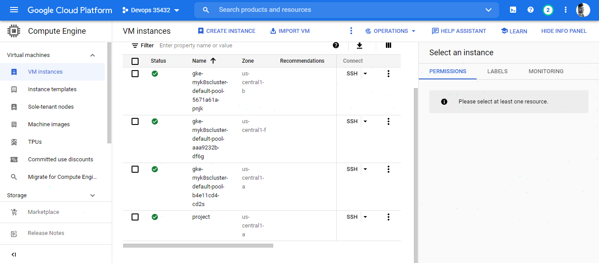 
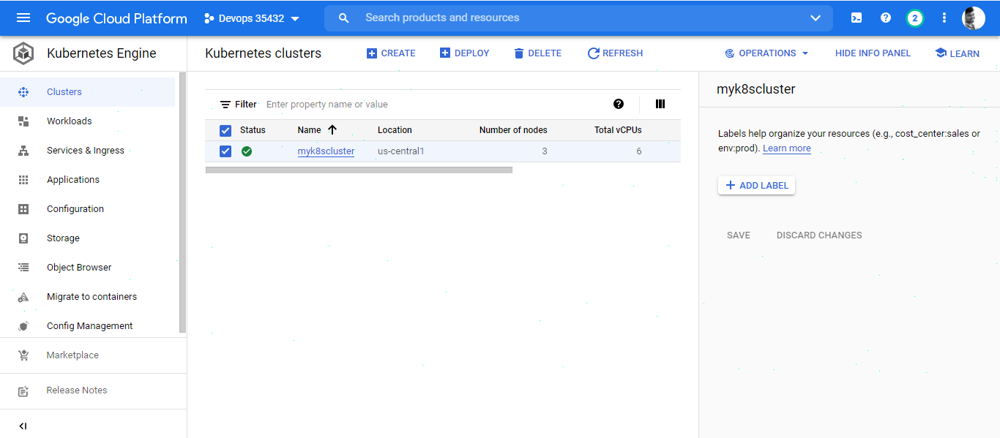 
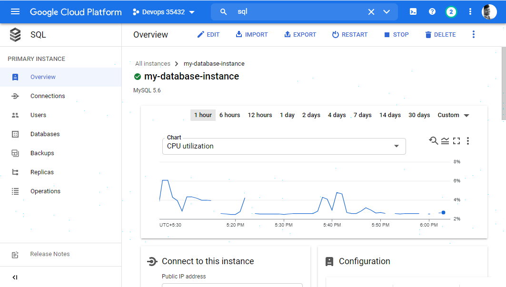

<strong>Terraform</strong> 
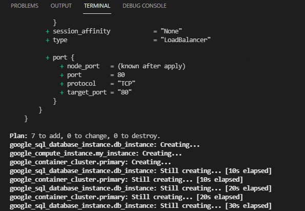 
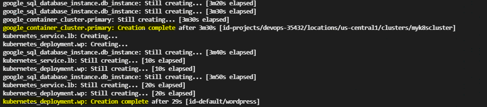 
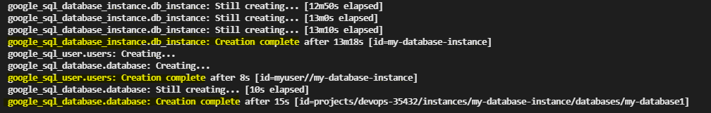 
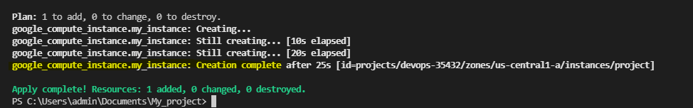 
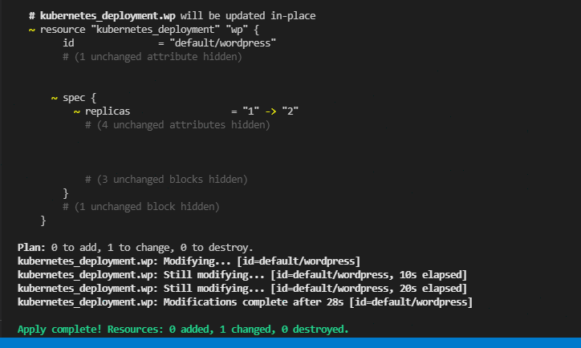

<strong>Wordpress</strong>

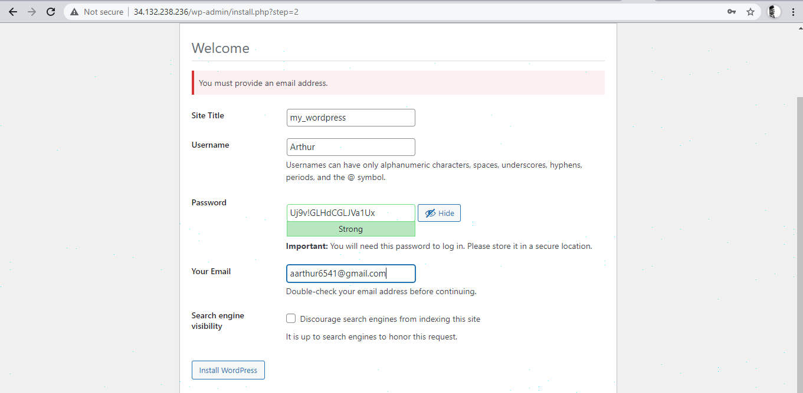 
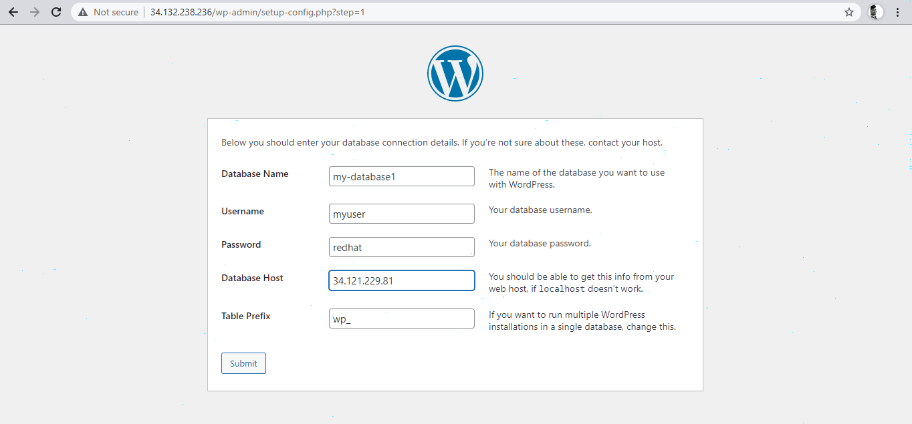 
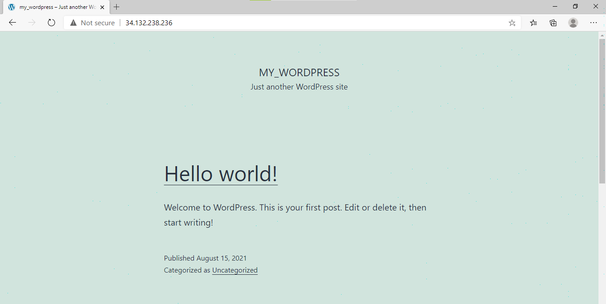

